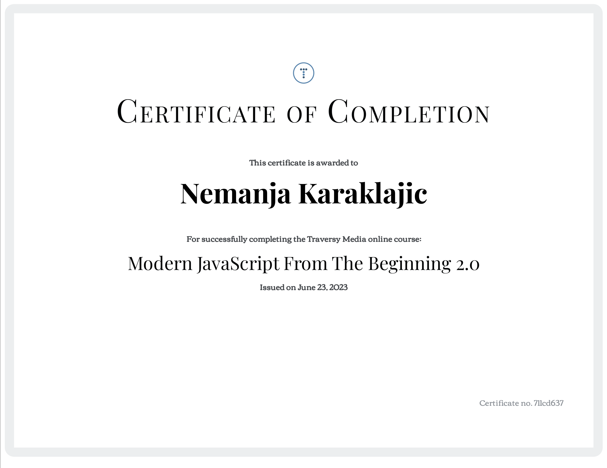
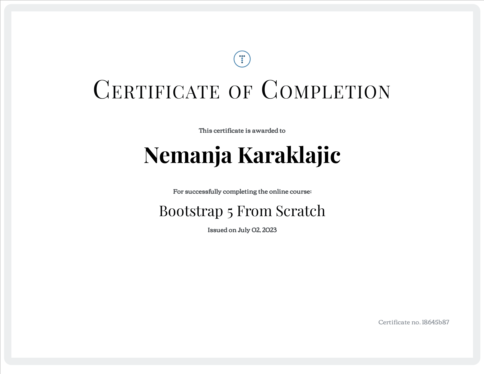

<h2 align="center">
<b>My name is Nemanja, and I am junior frontend developer from Serbia 🇷🇸</b>
</h2>

[//]: # (&#40;<a href="link" target="_blank">here</a> click and download my CV&#41;)

 

[//]: # (<iframe src="https://giphy.com/embed/qgQUggAC3Pfv687qPC" width="480" height="360" frameBorder="0" class="giphy-embed" allowFullScreen></iframe>)

## 👨🏼‍💻 About me
Hi there! 
I am junior web developer adept in React & JavaScript. Enthusiastic and adaptable professional with a background in civil engineering, eager to leverage technical acumen and problem-solving skills in a dynamic web development role. Passionate about technology and coding, seeking to apply a solid foundation in engineering principles to create innovative and user-focused web solutions.
I intend to improve my skills after completing the course "Yandex Practicum": 
* TypeScript
* Svelte
* Bootstrap

Please check out my portfolio website on <a target="_blank" href="https://chilicode.netlify.app/">nemanjakaraklajic.com</a>

## 👨‍🎓 Education

### 🎓Diplomas
#### 
Bachelor of Science in Civil Engineering (Faculty of Technical Sciences Novi Sad, Serbia)

<b>Show More</b>

[//]: # (#### 
Junior Frontend Developer &#40;Yandex Practicume&#41;

<b>Show More</b>
[]&#40;link&#41;

)

### 🏅Certificates

#### 
Modern JavaScript from The Beginning 2.0 (Traversy Media)

<b>Show More</b>

#### 
Bootstrap 5 From Scratch | Build 5 Modern Websites (Traversy Media)

<b>Show More</b>

### 🚵🏻‍♂️ Hobbies
Also, I would like to add that I am passionate runner. In the past I was both training and racing as professional triathlete. I did many races in my country and out as well. Lastly I ran a marathon (42,2 km) in Moscow.
I travel as much as possible, intend to visit, to me unknown places around the world.

## ⚙️ My skills
<b>Frontend:</b>
 

[//]: # ()

[//]: # ()

[//]: # ()

[//]: # ()

<b>Backend:</b>
 

<b>General:</b>
 

<i hre target="_blank"></i>

<i>
</i>
<i></i>

<i href="" target="_blank"></i>
<i href="" target="_blank"></i>
<i href="" target="_blank"></i>

 

<i>💡 - Click-on badge will take You to the repository, an example of written code, or you can take a look on all of my <a href="https://github.com/letStayFoolish?tab=repositories">repositories.</a></i>
 
<h2 align="center">📊 My stats:</h2>

  
 
  
   
  
   

[//]: # (  Solve <b>...</b> tasks on <a href="https://www.codewars.com/users/letStayFoolish">Codewars</a>, <b>...</b> - on <a href="">...</a>)

<h2 align="center">✉️ Connect with me:</h2>

  
  
  

