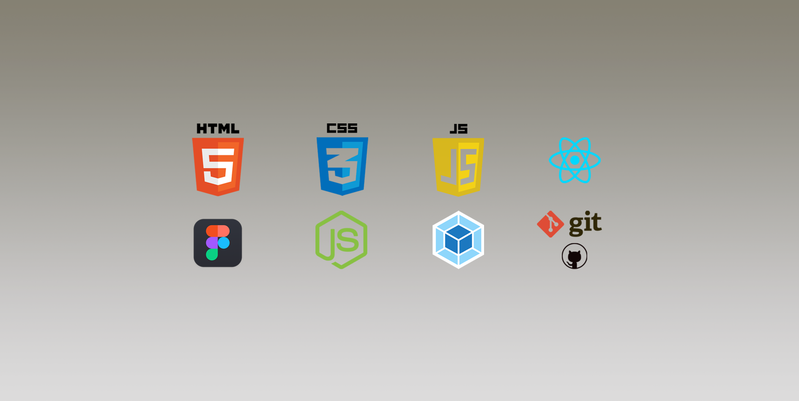

<h2 align="center"><b>Hello there! 👋🏽
 
My name is Nemanja, and I am junior frontend developer from Serbia 🇷🇸</b>
</h2>

[//]: # (&#40;<a href="link">here</a> click and download my CV&#41;)

 

[//]: # (<iframe src="https://giphy.com/embed/qgQUggAC3Pfv687qPC" width="480" height="360" frameBorder="0" class="giphy-embed" allowFullScreen></iframe>)

## 👨🏼‍💻 About me
I am resourceful engineer who is highly motivated and ambitious individual thriving for perfection in everything I do. Physically fit and able to work from office and at remote locations, I am more than willing to undertake any work of technical nature that falls within my ability and competence. Also, I have a solid record of health, safety and environmental focus when working on projects, and I am committed to my personal and professional development.I have a great deal of experience with working solo and team projects.
I intend to improve my skills after completing the course "Yandex Practicum": 
* TypeScript
* Svelte
* Bootstrap

## 👨‍🎓 Education

### 🎓Diplomas
#### 
Bachelor of Science in Civil Engineering (Faculty of Technical Sciences Novi Sad, Serbia)

<b>Show More</b>

[//]: # (#### 
Junior Frontend Developer &#40;Yandex Practicume&#41;

<b>Show More</b>
[]&#40;link&#41;

)

### 🏅Certificates

#### 
Modern JavaScript from The Beginning 2.0 (Traversy Media)

<b>Show More</b>

### 🚵🏻‍♂️ Hobbies
Also, I would like to add that I am passionate runner. In the past I was both training and racing as professional triathlete. I did many races in my country and out as well. Lastly I ran a marathon (42,2 km) in Moscow.
I travel as much as possible, intend to visit, to me unknown places around the world.

## ⚙️ My skills
<b>Frontend:</b>
 

[//]: # ()

[//]: # ()

[//]: # ()

[//]: # ()

<b>Backend:</b>
 

[//]: # ()

[//]: # ()

<b>General:</b>
 

<i>
</i>
<i></i>

<i href=""></i>
<i href=""></i>
<i href=""></i>

 

<i>💡 - Click-on badge will take You to the repository, an example of written code, or you can take a look on all of my <a href="https://github.com/letStayFoolish?tab=repositories">repositories.</a></i>
 
<h2 align="center">📊 My stats:</h2>

  
 
  
   
  
   

[//]: # (  Solve <b>...</b> tasks on <a href="https://www.codewars.com/users/letStayFoolish">Codewars</a>, <b>...</b> - on <a href="">...</a>)

<h2 align="center">✉️ Connect with me:</h2>

  
  
  

